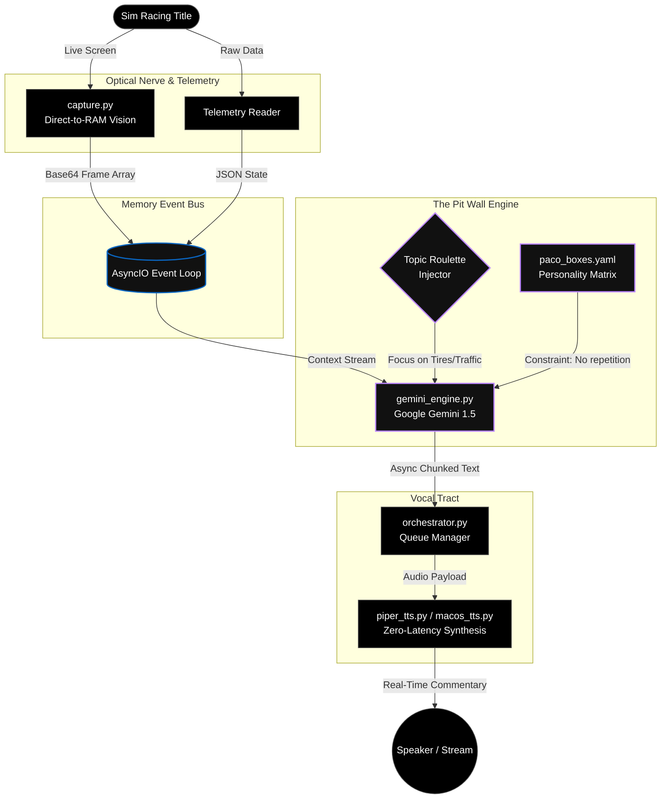

# `[ ARCHITECTURE BLUEPRINT ]`
*— Autonomous Multi-Modal Cognitive Engine —*

> "Mapping the flow of kinetic data from optical perception to audio generation."

---

## 1. System Data Flow (The Nervous System)

This diagram illustrates the asynchronous, decoupled event-driven architecture that powers the AI commentator. The entire system is built around a central memory bus, allowing perception, cognition, and execution to operate independently at their maximum clock speeds.

---

## 2. Advanced Subsystems

### 2.1 The "Topic Roulette" (Anti-Fatigue Architecture)
A fundamental flaw in traditional AI commentary is **cognitive loop fatigue**: LLMs default to safely describing the most obvious visual element repeatedly (e.g., "He is turning left"). 

To eliminate this friction, Vael designed the **Topic Roulette**.
*   **Mechanism:** An asynchronous loop that injects a highly specific, randomized systemic prompt into the LLM's context window every few seconds automatically (e.g., `FORCED_FOCUS: Analyze Tire Thermals only`, `FORCED_FOCUS: Critique Race Craft`).
*   **Result:** The AI is forced to shift its analytical lens dynamically, creating a multi-dimensional, human-like narration without relying on hardcoded pre-recorded lines.

### 2.2 Direct-to-RAM Optical Perception
*   **Problem:** Writing screenshots to disk (`.png`, `.jpg`) creates catastrophic I/O bottlenecks in a sub-second loop.
*   **Vael Solution:** `capture.py` grabs the memory buffer of the selected monitor, uses `PIL` to construct an image array natively in RAM, compresses it, and encodes it directly to Base64 in a single volatile pass. Disk I/O equates to exactly 0 bytes per frame.
